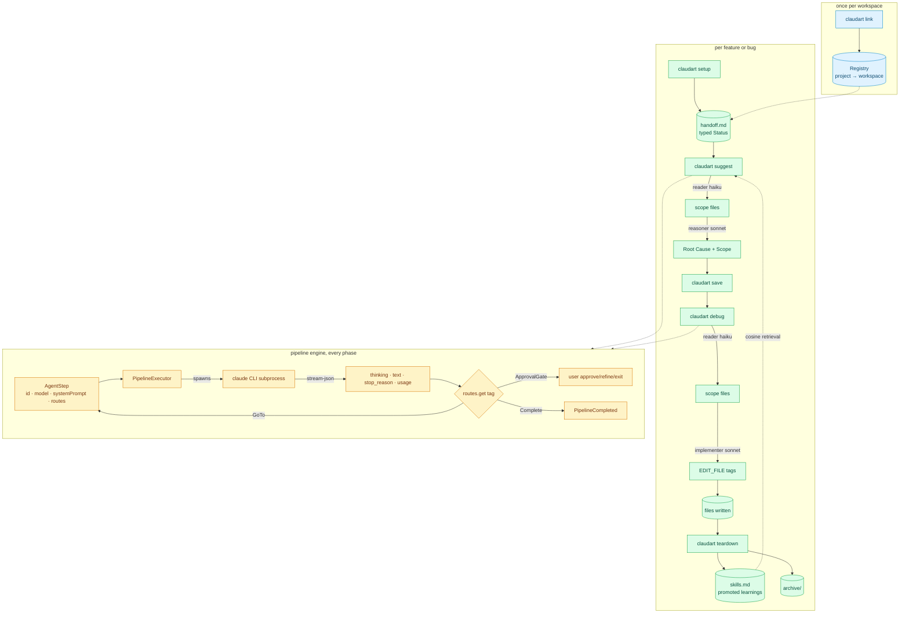
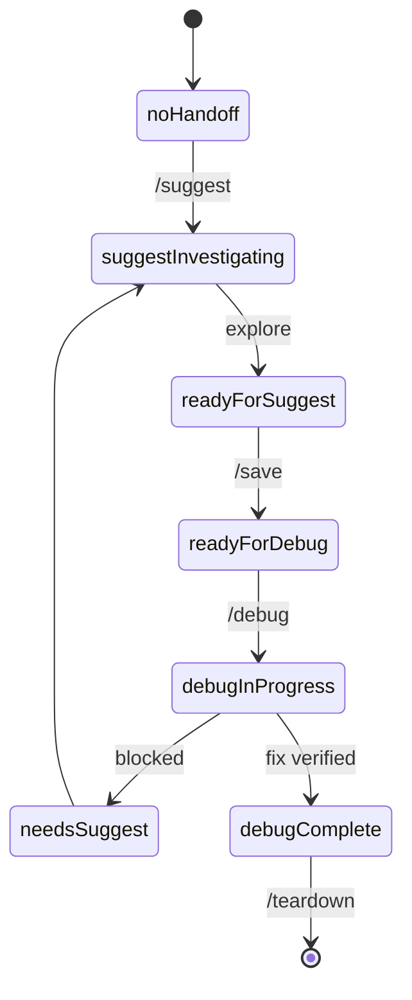
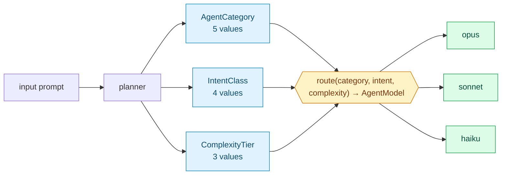
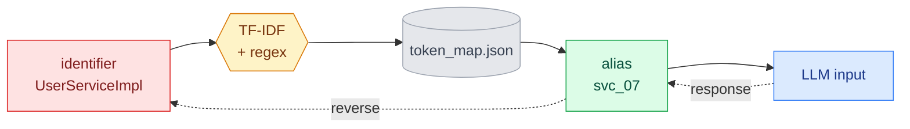
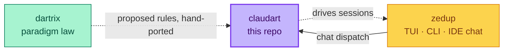

# claudart

**A typed, self-hosting session harness for Claude Code.** claudart manages the state between AI coding sessions so the model always starts already knowing the bug, the scope, and what's been tried. Every session state is an enum. Every model routing decision is a total function. The tool debugs its own bugs using its own workflow.

> Not an Anthropic product. Built for Claude Code + Dart/Flutter projects.
>
> **Deep dive:** [PLAN.md](PLAN.md) carries the full architecture. [docs/design.md](docs/design.md) is the formal FSA proof.

---

## Contents

- [What it is](#what-it-is)
- [How it works](#how-it-works)
- [Proof](#proof), real transcripts, not claims
- [Full architecture](#full-architecture)
- [Why the typed state matters](#why-the-typed-state-matters)
- [Token efficiency](#token-efficiency)
- [CLI surface](#cli-surface)
- [Skills + retrieval](#skills--retrieval)
- [Authentication](#authentication)
- [Workspace structure](#workspace-structure)
- [Roadmap](#roadmap)
- [Cross-repo](#cross-repo)
- [Related](#related)

---

## What it is

**claudart** is a compiled Dart CLI you run in your terminal. It owns everything *between* sessions: writing structured context before you open your editor, checkpointing discoveries mid-session, abstracting sensitive identifiers before they leave your machine, and extracting learnings when a session ends.

**Claude Code** is the AI assistant in your editor. You drive it through slash commands, `/suggest`, `/debug`, `/save`, `/teardown`. It reads the context claudart wrote, so it never starts a session blind.

| | claudart | Claude Code |
|---|---|---|
| **What** | Dart CLI binary at `~/bin/claudart` | AI assistant in your editor |
| **Where** | terminal | IDE chat panel |
| **You type** | `claudart setup`, `claudart teardown` | `/suggest`, `/debug`, `/save` |
| **It owns** | session state, workspace config, skills, privacy | exploration, fix implementation |
| **Runs on** | your machine only (`~/.claudart/`) | Anthropic servers (reads abstracted context) |

---

## How it works

A session is a state machine, not a chat log. `claudart setup` writes a `handoff.md` with a typed `Status` field. Every command that touches that file reads the status, decides what's legal next, and writes a new status back. There's no free text driving control flow anywhere in the loop.

Under the hood, each phase (`suggest`, `debug`, `flow`) runs a small pipeline of typed steps. A step declares its model, its system prompt, and a routing table mapping the tags it might emit to what happens next. The executor spawns the real `claude` CLI as a subprocess for each step, parses the structured output, and follows the route. Nothing about "what happens after this step" lives in prose or in the model's head. It lives in a `Map<RouteTag, StepRoute>` that compiles.

---

## Proof

<details>
<summary><strong>A real session, start to finish</strong></summary>

This is an actual `claudart setup` → `claudart suggest` → `claudart debug` → `claudart teardown` run against this repo, investigating a real question (does claudart need a runtime dependency on dartrix). Not a demo script. The literal CLI, piped real answers, spawning real `claude` API calls.

```
$ claudart setup
─── claudart ───────────────────────────────
  Branch : feature/bare-string-lint
  Status : ready-for-debug
  ...
  2. Start fresh  overwrite handoff with new context
Previous session archived → handoff_feature_bare-string-lint_2026-09-21T15-20-41.md

1. What is the bug? (actual behavior)
> Does claudart's shipped runtime (lib/) actually depend on dartrix at runtime...
✓ Handoff written to .../handoff.md

$ claudart suggest
  [1] Read files › [2] Reason › [3] Write handoff
  ✓ Result  claudart / reader     in 1.2k · out 890 · $0.014
  ✓ Result  claudart / reasoner   in 3.1k · out 1.4k · $0.041
Root Cause:
  Nothing is broken in the runtime dependency graph. The verdict is (a):
  claudart correctly does not need a runtime dependency on dartrix.
  `pubspec.yaml` lines 23-24 place dartrix in `dev_dependencies` only...

$ claudart debug
  [1] Read files › [2] Implement › [3] Write files
  ✓ Result  claudart / implementer   in 17 · out 5.3k · $0.048
✓ Wrote 1 file: tool/claudart_lints/lib/claudart_lints.dart

$ claudart teardown
✓ Skills updated: .../skills.md
✓ Handoff archived: .../archive/handoff_feature_step-result-metadata_....md
✓ Handoff reset.
```

The fix it wrote landed as a library doc comment on the lint package explaining the exact dependency verdict, unprompted about the specific wording, just given the bug and expected behavior. Verified with `dart analyze` and `dart run custom_lint`, both clean, before commit.

</details>

<details>
<summary><strong>Extended thinking, captured and attributed</strong></summary>

`defaultClaudeRunner` parses the real `--output-format stream-json --include-partial-messages` stream, not just the final summary line. This is a real captured call:

```
text: 9 times 8 equals **72**...
thinking present: true
thinking (first 200 chars): The user is asking me to calculate 9 times 8...
thinkingTokens: 240
stopReason: end_turn
durationMs: 4528
numTurns: 1
usage: Usage(in:9, out:439, cached:10386, cacheWrite:6698, thinking:240, $0.0122881)
```

240 of the 439 output tokens went to reasoning the model never showed in its answer, now attributed and queryable, not silently discarded.

</details>

<details>
<summary><strong>Lint rules catch violations in claudart's own code, live</strong></summary>

`bare_string_for_enum`, `enum_values_loop_in_single_test`, and `ungrouped_identical_switch_cases` are `custom_lint` rules enforcing this repo's own paradigms. They aren't theoretical, they've caught real violations in this codebase during development, including in code being written for this exact tool:

```
lib/pipeline/pipeline_executor.dart:429:3 •
  Switch dispatches on string literals instead of an enum.
  Model these cases as an enum and switch on it. •
  bare_string_for_enum • ERROR
```

That specific violation was in a stream-event parser being added the same session, caught before it shipped, fixed by introducing a typed `_StreamEventType` enum instead of switching on raw JSON strings.

</details>

---

## Full architecture



Three layers, each independently testable. `Registry` maps a git project to its workspace once, at `link` time. The session layer is the state machine described above, `handoff.md`'s typed status driving what command runs next. The engine layer is shared by every phase, `suggest` and `debug` are both just a specific list of `AgentStep`s handed to the same `PipelineExecutor`.

---

## Why the typed state matters

**`HandoffStatus`** replaces magic strings with an enum. Every transition is typed, every dispatch is an exhaustive switch, adding a new state without updating every switch is a compile error, not a runtime surprise.



[`HandoffStatus`](lib/session/session_state.dart#L7), eight values, exhaustive switch in [`teardown_utils.dart`](lib/session/teardown_utils.dart) and every dispatch site.

**The planner** routes every input on three orthogonal axes to a model, a total function over sixty cells.



- **[`AgentCategory`](lib/pipeline/agents/categorization.dart#L25)**, `feature`, `bug`, `refactor`, `research`, `setup`.
- **[`IntentClass`](lib/pipeline/agents/categorization.dart#L48)**, `explore`, `analyze`, `implement`, `document`. Partition: the four variants cover the whole set.
- **[`ComplexityTier`](lib/pipeline/agents/categorization.dart#L59)**, `atomic`, `compound`, `systemic`. `atomic` and `systemic` never overlap.

Three concrete routings:

| Input | Classification | Model |
|---|---|---|
| "implement gap cross-ref in side panel" | `feature × implement × atomic` | `sonnet` |
| "explain how this codebase handles state" | `research × explore × systemic` | `opus` |
| "what does HandoffStatus do" | `research × document × atomic` | `haiku` |

Rules, in [`routeModel`](lib/pipeline/agents/categorization.dart#L78): systemic explore or analyze goes to `opus` for broad reasoning. Any analyze or implement goes to `sonnet` for balanced generation. Atomic explore or any document goes to `haiku` for fast lookup. The switch is exhaustive over every combination.

**`StepMode`** is the same discipline applied to how a pipeline step invokes the `claude` CLI. It replaced a raw boolean this session, after live-testing found the boolean flag silently broke OAuth authentication when set. An enum with named variants makes that failure mode a documented case instead of a hidden trap.

---

## Token efficiency

Sensitive identifiers get abstracted before any prompt leaves your machine. The reverse mapping resolves on response.



Same task, unstructured chat versus the claudart pipeline:

| Strategy | Input tokens | Output tokens | Total |
|---|---|---|---|
| Unstructured chat, one big prompt | ~24,000 | ~3,800 | ~27,800 |
| claudart, scaffold once + per-feature handoff | ~6,500 | ~3,200 | ~9,700 |

About 65% reduction. Numbers are typical, not benchmarks.

The suggest pipeline's refinement loop compounds this further. When you ask for a change, the applier step sends and receives only the analysis sections your feedback actually targets, not the full six-section document round-tripped on every pass. If a targeted section doesn't exist yet, it falls back to the full document rather than silently failing to add it, verified with a real regression test, not just an assumption.

---

## CLI surface

```bash
claudart setup          # bootstrap workspace, write handoff.md
claudart status         # show session state
claudart suggest        # run suggest pipeline (agent dispatch)
claudart save           # checkpoint, lock root cause
claudart debug          # run debug pipeline (implement fix)
claudart teardown       # archive, promote skills, suggest commit
claudart teardown --headless  # same, but resolves every decision itself
```

<details>
<summary><strong>Full command table</strong></summary>

| Command | Role | Code |
|---|---|---|
| `archives` | list session archives, resume or view | [bin/claudart.dart:113](bin/claudart.dart#L113) |
| `init` | workspace initialization | [bin/claudart.dart:115](bin/claudart.dart#L115) |
| `link` | symlink + register + setup sensitivity | [bin/claudart.dart:117](bin/claudart.dart#L117) |
| `unlink` | remove symlinks cleanly | [bin/claudart.dart:119](bin/claudart.dart#L119) |
| `setup` | start session, write handoff.md | [bin/claudart.dart:121](bin/claudart.dart#L121) |
| `status` | session state, compact for shell | [bin/claudart.dart:125](bin/claudart.dart#L125) |
| `teardown [--headless]` | archive, promote skills; `--headless` resolves every decision itself | [bin/claudart.dart:127](bin/claudart.dart#L127) |
| `suggest` | run suggest pipeline | [bin/claudart.dart:131](bin/claudart.dart#L131) |
| `debug` | run debug pipeline | [bin/claudart.dart:133](bin/claudart.dart#L133) |
| `flow` | experimental agent-constructed session | [bin/claudart.dart:135](bin/claudart.dart#L135) |
| `save` | checkpoint session | [bin/claudart.dart:137](bin/claudart.dart#L137) |
| `rotate` | archive, build gate, seed next from Pending Issues | [bin/claudart.dart:139](bin/claudart.dart#L139) |
| `kill` | abandon session, no skills update | [bin/claudart.dart:141](bin/claudart.dart#L141) |
| `preflight <op>` | sync check, debug, save, or test | [bin/claudart.dart:145](bin/claudart.dart#L145) |
| `scan` | rescan for sensitive tokens | [bin/claudart.dart:148](bin/claudart.dart#L148) |
| `report` | diagnostic report, file GitHub issues | [bin/claudart.dart:163](bin/claudart.dart#L163) |
| `map` | generate token_map.md from token_map.json | [bin/claudart.dart:170](bin/claudart.dart#L170) |
| `experiment` | tee command output to experiments/ | [bin/claudart.dart:176](bin/claudart.dart#L176) |
| `compile` | rebuild the binary | [bin/claudart.dart:178](bin/claudart.dart#L178) |
| `version` | print version | [bin/claudart.dart:90](bin/claudart.dart#L90) |

</details>

---

## Skills + retrieval

Skills are persistent learnings extracted by `teardown`. Each is a small markdown entry. On `suggest`, claudart picks the top-k most relevant by cosine similarity over a TF-IDF embedding:

```
score(query, skill) = (q · s) / (‖q‖ · ‖s‖)
```

`q` is the term-frequency vector of the task description, `s` is the same for the skill body. Skills scoring above threshold get injected into context. Below threshold, they're ignored at zero token cost.

Adding a skill is automatic, `teardown` writes it. Pruning is a manual review step in `claudart rotate`.

---

## Authentication

claudart's pipeline steps spawn the real `claude` CLI as a subprocess and rely on whatever session you're already logged into, the normal `claude login` OAuth flow. Each step gets its own `--session-id` so it doesn't collide with your interactive Claude Code session, but it deliberately does not isolate the config directory, because that copies your credential and the copy goes stale as the OAuth token rotates. Isolating by session, not by config, is what keeps a claudart-driven step authenticated with nothing more than the login you already have.

This is also why no built-in step passes `--bare` to the subprocess. `--bare` is real and useful, minimal mode, skips hooks, LSP, plugin sync, and CLAUDE.md auto-discovery, but it comes with a hard requirement. It reads only `ANTHROPIC_API_KEY` or an `apiKeyHelper`. OAuth and keychain credentials are never read under `--bare`, by design. A normal OAuth session gets `Not logged in` if you try it, verified directly against the live CLI, not assumed.

If you run claudart with `ANTHROPIC_API_KEY` set instead of an OAuth login, both paths work. `defaultClaudeRunner` doesn't touch either credential source itself, it only decides `--session-id` and, when a step opts into `StepMode.bare`, `--bare`.

---

## Workspace structure

<details>
<summary><strong>What lives on disk</strong></summary>

```
~/.claudart/
├── workspace.json              # owner, stack, knowledge scope
├── scaffold.md                 # baked once by Agent 1
├── token_map.json              # identifier → alias map
├── projects/
│   └── <project>/
│       ├── handoff.md          # active session state
│       ├── skills.md           # promoted learnings
│       └── archive/            # rotated session archives
└── logs/
    ├── interactions.jsonl
    └── errors.jsonl
```

</details>

---

## Roadmap

<details>
<summary><strong>What's coming</strong></summary>

| Phase | Scope | Status |
|---|---|---|
| 1 | CLI + workspace + scaffold | shipped |
| 2 | Sensitivity mode + token map | shipped |
| 3 | Skills + cosine retrieval | shipped |
| 4 | Static analysis scanner | shipped |
| 5 | Design subagent | deferred, see [PLAN.md](PLAN.md) |
| 6 | Agent flow registry + planner.dart | planned |
| 7 | Per-step thinking/cost metadata surfaced live in a TUI dependency graph | planned |

</details>

---

## Cross-repo



claudart runs standalone. It has zero runtime dependency on dartrix, verified by grepping every import in `lib/`, dartrix sits in `dev_dependencies` only, used for test-time matrix coverage. Paradigm enforcement lives in claudart's own `custom_lint` rules, which re-derive dartrix's `PARADIGMS.md` prose by hand. The sync is a process, propose a rule to dartrix, then hand-port the lint, not a code dependency. zedup consumes claudart's slash commands and dispatches through it, but claudart doesn't depend on zedup either.

---

## Related

- **[dartrix](https://github.com/liitx/dartrix)**, the paradigm law. `PARADIGMS.md` defines the rules claudart's `custom_lint` package enforces.
- **[zedup](https://github.com/liitx/zedup)**, TUI dashboard and work tracker. Hosts an in-editor claudart chat panel, dispatches `/suggest`, `/debug`, `/save` through the typed `AgentModel` registry.
